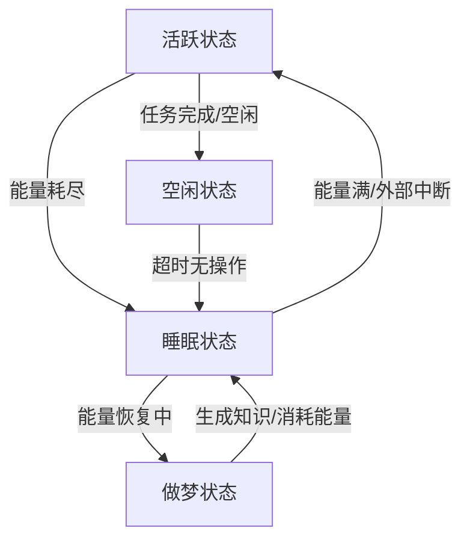

# 产品需求文档 (PRD): 自主记忆整合 (Dreaming)

| 文档版本 | V1.0 |
| :--- | :--- |
| **状态** | 待评审 |
| **负责人** | Product Owner Agent |
| **涉及模块** | `src/storage/memory.py`, `src/utils/needs.py`, `src/utils/enhanced_lifecycle.py` |

## 1. 背景与现状 (Context)

### 1.1 业务背景
当前的 AI Agent 拥有长短期记忆系统，能够记录对话和经验。然而，记忆的整理（Consolidation）目前依赖于手动触发或简单的周期性调用，缺乏与 Agent 生理状态（Needs System）的深度联动。

### 1.2 现状分析
基于 `src/storage/memory.py` 和 `src/utils/enhanced_lifecycle.py` 的分析：
- **触发机制**：`consolidate_memories` 方法存在，但仅在 `EnhancedLifeCycleManager` 中通过固定计数器（每10个周期）触发，不够智能。
- **生理联动**：目前“做梦”消耗能量（5.0单位），获取知识补充能量。缺乏一个真正的“睡眠”状态来恢复基础能量。
- **整合逻辑**：当前的整合逻辑主要是调用 LLM 提取“关键事实”，比较单一。
- **反思能力**：虽然有基础的反思模块，但缺乏针对“失败任务”的系统性复盘机制。

## 2. 产品目标 (Goals)

1.  **自动化睡眠/做梦循环**：将记忆整合过程与 Agent 的“空闲”或“低能量”状态绑定，实现自主的昼夜节律。
2.  **增强记忆整合逻辑**：从简单的“事实提取”升级为“经验压缩”和“技能内化”。
3.  **构建反思机制**：在做梦过程中专门处理失败的经验，生成纠正性知识（Self-Correction）。
4.  **完善生理经济系统**：建立 `睡眠(恢复能量)` -> `做梦(消耗部分能量/整理记忆)` -> `苏醒(高能量/高知识)` 的闭环。

## 3. 用户故事 (User Stories)

| ID | 角色 | 故事描述 | 价值/目的 |
| :--- | :--- | :--- | :--- |
| US-01 | Agent | 作为 Agent，我希望在能量低或无任务时自动进入“睡眠模式”。 | 恢复能量，避免“死亡”。 |
| US-02 | Agent | 作为 Agent，我希望在睡眠中“做梦”，分析白天失败的任务。 | 从错误中学习，避免重蹈覆辙。 |
| US-03 | Agent | 作为 Agent，我希望将琐碎的短期对话压缩为长期知识。 | 释放短期记忆空间，构建长期知识库。 |
| US-04 | 开发者 | 作为开发者，我希望看到 Agent 在做梦后产出具体的“反思报告”。 | 验证 Agent 的自我进化能力。 |

## 4. 功能需求 (Functional Requirements)

### 4.1 睡眠与做梦机制 (Sleep & Dream Cycle)

**逻辑变更点**：`src/utils/enhanced_lifecycle.py`, `src/utils/needs.py`

*   **新增状态**：在 `IDLE` (空闲) 和 `ACTIVE` (活跃) 之外，新增 `SLEEP` (睡眠) 状态。
*   **触发条件**：
    *   **被动触发**：当 `Energy < 20%` (Critical Threshold) 时，强制进入睡眠。
    *   **主动触发**：当 `State == IDLE` 且持续时间超过 `N` 分钟，自动进入小憩（Nap）。
*   **唤醒条件**：
    *   `Energy == 100%` (睡饱了)。
    *   收到高优先级的外部任务指令（被叫醒）。

### 4.2 生理系统集成 (Needs Integration)

**逻辑变更点**：`src/utils/needs.py`

*   **睡眠恢复 (Energy Restoration)**：
    *   在 `SLEEP` 状态下，`Needs.update()` 不再消耗能量，而是以 `recovery_rate` (如 5.0/min) 恢复能量。
*   **做梦消耗 (Dream Cost)**：
    *   睡眠过程中会间歇性进入 `DREAMING` 阶段。
    *   每次做梦处理消耗一定能量（如 10.0），但这通常会被睡眠恢复的能量覆盖，或者在苏醒后因获得“知识”而得到奖励。
    *   **公式**：`净能量变化 = 睡眠恢复量 - 做梦消耗量`。

### 4.3 深度记忆整合 (Deep Consolidation)

**逻辑变更点**：`src/storage/memory.py` (修改 `consolidate_memories`)

将单一的 Summarization 拆分为三个阶段：

1.  **清洗 (Cleaning)**：
    *   识别并删除琐碎的交互记忆（如 "Hello", "OK" 等无实质内容的对话）。
    *   规则：保留时间 < 24小时且 Importance < 2 的记忆用于清洗。

2.  **压缩 (Compression)**：
    *   将同一主题的多轮对话合并为一条摘要。
    *   *Prompt 示例*："将以下关于 Python 报错的 10 轮对话压缩为 1 个问题和 1 个解决方案。"

3.  **内化 (Internalization)**：
    *   将高频出现的模式转化为“直觉”（Knowledge）。
    *   如果某条知识被多次检索，提升其 Importance 权重。

### 4.4 反思与自我修正 (Reflection & Self-Correction)

**新增功能**：`src/storage/memory.py` 中新增 `reflect_on_failures()` 方法。

*   **输入**：检索 metadata 中标记为 `status: failed` 或 `emotion: frustration` 的近期记忆。
*   **处理**：调用 LLM 分析失败原因。
    *   *Prompt*："你之前在执行任务 X 时失败了，错误信息是 Y。请分析根本原因，并制定一条‘行事准则’以避免下次再次发生。"
*   **输出**：生成一条新的 Knowledge，类型为 `Correction`。
    *   *示例*："错误：文件未找到。修正知识：在读取文件前，必须先使用 `os.path.exists` 检查路径是否存在。"

## 5. 详细设计与规则

### 5.1 状态机流转图



### 5.2 接口定义 (Interface Changes)

#### `src/utils/needs.py`
```python
class Needs:
    def recover(self, duration_minutes: float):
        """睡眠时的能量恢复"""
        recovery_amount = self.recovery_rate * duration_minutes
        self.energy = min(self.max_energy, self.energy + recovery_amount)
```

#### `src/storage/memory.py`
```python
class MemorySystem:
    def trigger_dreaming_sequence(self):
        """执行完整的做梦序列"""
        # 1. 清洗琐碎记忆
        self._cleanup_trivial_memories()
        # 2. 反思失败
        corrections = self._reflect_on_failures()
        # 3. 整合成功经验
        facts = self.consolidate_memories()
        return {"corrections": corrections, "facts": facts}
```

## 6. 非功能需求 (Non-functional Requirements)

-   **性能**：做梦过程涉及大量 LLM 调用，必须在后台线程运行，且不能阻塞主线程响应外部高优先级指令。
-   **成本**：为了控制 Token 消耗，做梦前应先通过规则过滤掉 80% 的无效记忆，仅对高价值记忆进行 LLM 处理。
-   **可观测性**：每次做梦结束后，应生成一份日志 `dream_report_{timestamp}.md`，记录清洗了多少记忆、生成了什么新知识。

## 7. 验收标准 (Acceptance Criteria)

1.  **自动化测试**：
    *   将 Agent 能量手动设为 10，Agent 应自动进入 Sleep 状态。
    *   在 Sleep 状态下，能量应随时间自动增加。
2.  **反思功能验证**：
    *   构造一个失败的任务记录（如“除以零错误”）。
    *   触发做梦后，知识库中应新增一条关于“检查除数是否为零”的知识点。
3.  **记忆压缩验证**：
    *   输入 20 条连续对话，做梦后，Raw Memory 表中的记录数减少，Knowledge 表中增加 1-2 条总结性记录。

## 8. 实施计划 (Roadmap)

1.  **Phase 1 (基础架构)**：修改 `Needs` 类支持能量恢复，修改 `Lifecycle` 支持 Sleep 状态。
2.  **Phase 2 (核心逻辑)**：实现 `reflect_on_failures` 和改进版 `consolidate_memories`。
3.  **Phase 3 (集成测试)**：在 `main.py` 运行长周期测试，观察 Agent 是否能自主存活并变强。
